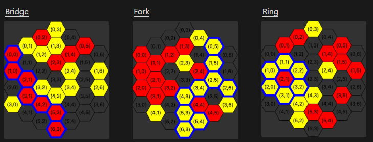

# Havannah Playing Agent

This project implements a **game-playing AI agent** for the board game *Havannah*.

---

## 🎯 **About Havannah**  
Havannah is a two-player abstract strategy game invented by Christian Freeling. Players take turns placing their stones on hexagonal cells of a board, aiming to achieve one of the following winning conditions:  
1. **Ring**: Form a loop of stones enclosing one or more cells.  
2. **Bridge**: Connect any two corners of the board.  
3. **Fork**: Connect any three edges of the board.  

  

---

## 🚀 **Features**  
- **Smart Decision Making**: Implements search algorithms MCTS with RAVE and UCB to optimize move selection.  
- **Heuristic Evaluation**: A custom evaluation function assesses board positions to enhance decision quality.  
- **Scalability**: Supports various board sizes, from beginner-friendly small boards to full-size competitive ones.  
- **Interactive Play**: Play against the AI in a dynamic interface or simulate AI vs. AI matches to observe its strategic prowess.  

---

## 📖 **Setup**

Have a look at the [setup file](setup.md) for detailed instructions on setting up the environment and usage. 

---

## 🎮 **Future Enhancements**  
- **Machine Learning Integration**: Train the AI using reinforcement learning to improve over time.  
- **Dynamic Heuristics**: Adapt heuristics based on player behavior for more challenging games.  

---

## 📄 **License**  
This project is licensed under MIT; look at the [LICENSE](LICENSE) file for details.  

---

## 💡 **Acknowledgments**  
This work was completed as part of COL333 Assignment 2 at IIT Delhi, exploring search algorithms for game-playing agents under academic supervision.
